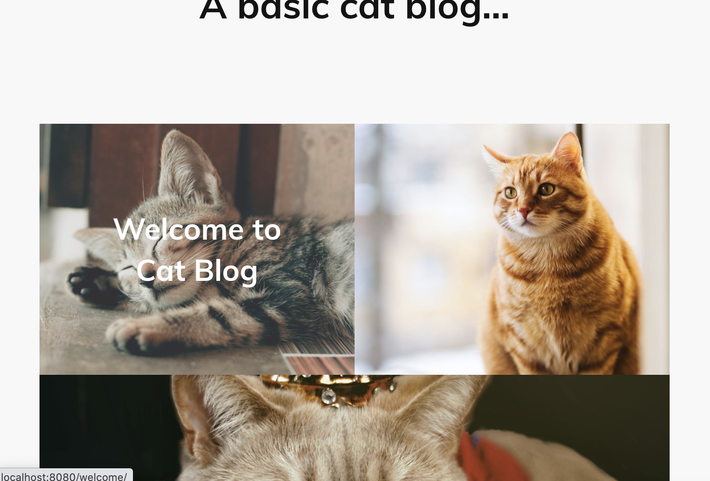
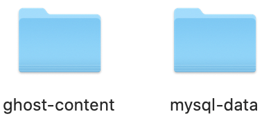

# Cat Blog
> Basic Blog with Ghost and MYSQL(Docker-compose test).

Ghost mounted in alpine container (Lightweight Linux) connect
to MYSQL container.



Volumes create a backup of ghost content folder and MYSQL data.

```sh
volumes: 
            - ./ghost-content:/var/lib/ghost/content
```
```sh
volumes: 
            - ./mysql-data:/var/lib/mysql
```


## Installation

Docker:
> In cat-blog directory:
```sh
docker-compose up -d
```
